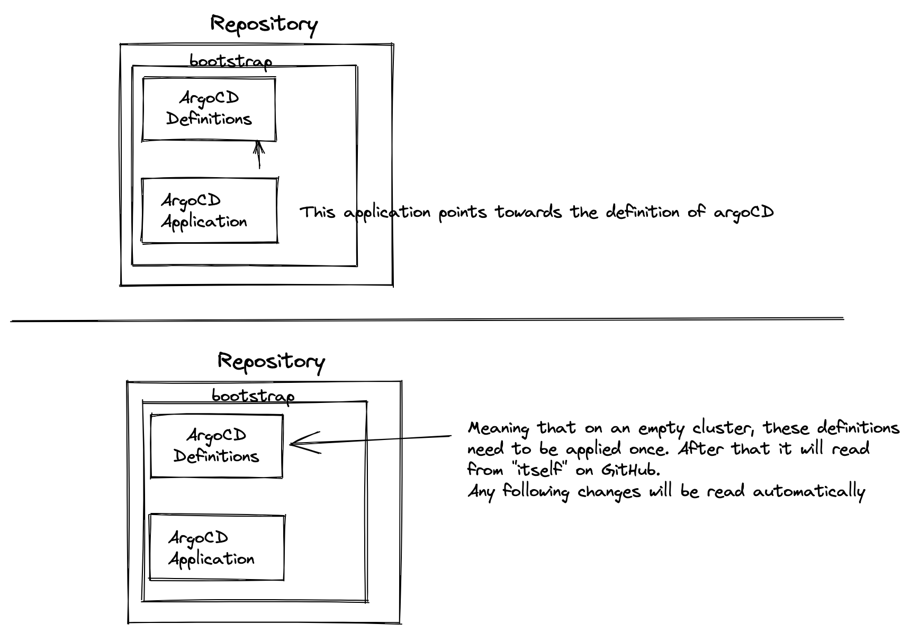

# Work in progress

This project is part of https://github.com/thanos-io/thanos/issues/4606, an GSoC/Community Bridge/LFX project to setup a publically accessible instance of Thanos.

## Contributing

At the moment we are setting up the base for the project. We are absolutely open for any input. Be it code, PR, involvement or feedback. However, documentation is still very scarce. The goals is to improve this over time so this project becomes way more accessible for everyone.

## CI/CD setup

We are using ArgoCD to deploy this project. ArgoCD is setup in a way that it is self managed.

The `argocd-bootstrap` folder contains the basics to:
- Setup ArgoCD
- Setup SealedSecrets
- Setup ArgoCD as an ArgoCD application itself (self setup)

## Folder structure

- applications/thanos
    - base: contains the **base** parts for setting up Thanos (at the moment only querier). No minor changes such as the image version should be made here. The only changes that make sense here are structural / foundation changes. Other changes should be in the overlay.
    - overlays/production: the only overlay we have. This contains the changes needed on the base part. For example the image tag
- argocd-applications: This contains `kind: Application` resources. This defines an ArgoCD application. The entire folder is always read by ArgoCD.
- argocd-bootstrap: This folder contains all the required files in case of starting this project on a brand new cluster. It will implement ArgoCD and sealed-secrets, and sets up ArgoCD application (including this directory itself).
    - base: contains the **base** parts for setting up Thanos (at the moment only querier). No minor changes such as the image version should be made here. The only changes that make sense here are structural / foundation changes. Other changes should be in the overlay.
        - argocd-app.yaml: the self reference towards this directory
        - argocd-applications.yaml: reference to `/argocd-applications/*` in include other ArgoCD applications
    - overlays/production:
        - multiple overrides for the ArgoCD setup

## short term Todo's

- Implement/setup
    - Prometheus(Operator)
    - Thanos sidecar
- Change
    - Move nginx ingress to git

## longer term Todo's

- Implement/setup
    - DNS reference to our LB
    - Certificate (Let's encrypt)
    - Possibly implement minio for objectstore offering
    - ^ Adding Thanos Store
    - Create some "homepage" with more information on how to use it + reference to the Cloud sponsor (Civo cloud)
